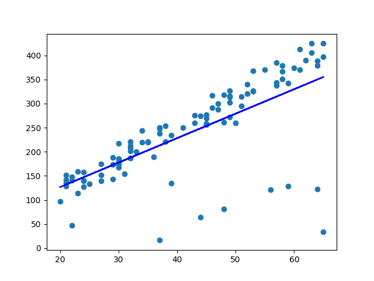

# 100-Days-of-ML

Joined udacity's [Intro to Machine Learning](https://www.udacity.com/course/intro-to-machine-learning--ud120) course and this repository is to keep my projects and records of this course.
#
## Naive Bayes
    Naive Bayes methods are a set of supervised learning algorithms based on applying Bayes’ theorem with the “naive” assumption of conditional independence between every pair of features given the value of the class variable
    It is classification algorithm which the order of objects doesn't matter.

>Using this algorithm I have performed a mini project  
[Naive Bayes](./naive_bayes/nb_author_id.py) using **sklearn.naive_bayes** and got **accuracy of 97.042%**.

- ### Output of Naive Bayes

    
#
## Support Vector Machine  
    Support-vector machines (SVMs, also support-vector networks[1]) are supervised learning models with associated learning algorithms that analyze data used for classification and regression analysis.
It is another classification algorithm . This algorithm **is much slower than** **Naive Bayes** but we can improve speed by reducing the training data size
but this will decreases the accuracy.

>Using this algorithm I have performed a mini project  
[SVM](./svm/svm_author_id.py) using **sklearn's svm** and got **accuracy of 99.345%**.

- ### Output of SVM

    
#
## Decision Trees
    Decision Trees are a type of Supervised Machine Learning (that is you explain what the input is and what the corresponding output is in the training data) where the data is continuously split according to a certain parameter. The tree can be explained by two entities, namely decision nodes and leaves.

- **Entropy** is the number of impurity or is equal to `sum of(-(pi*log(pi,2))`  
- **Information Gain** is equal to `Entropy(parent)-(weighted average)Entropy(chidlren)`  
- Decision Trees algorithm tries to **maximize the Information gain** and **minimize the Entropy**
>Using this algorithm I have performed a mini project  
[decision_tree](./decision_tree/dt_author_id.py) using **sklearn's decision tree** and got **accuracy of 97.923%**.

- ### Output of Decision Tree

    
#
## Choose Your Own 

1. ### **K nearest neighbors (KNN)**
       In supervised learning, this algorithm uses user-defined no of neighbors to give the lable of a new point. This algorithm is used for both classification and regression.

2. ### **AdaBoost(*Ada*ptive *Boost*ing)**
       AdaBoost (Adaptive Boosting) is a very popular boosting technique  that aims at combining multiple weak classifiers to build one strong classifier.  
    *For detailed information* [AdaBoost](https://blog.paperspace.com/adaboost-optimizer/#:~:text=AdaBoost%20is%20an%20ensemble%20learning,turn%20them%20into%20strong%20ones.)
3. ### **Random Forest**
       Random forests or random decision forests are an ensemble learning method for classification,regression and other tasks that operate by constructing a multitude of decision trees at training time and outputting the class that is the mode of the classes (classification) or mean prediction (regression) of the individual trees.

>Using these algorithms I have performed a mini project  
[choose_your_own](./choose_your_own) using **sklearn** and got **accuracy of 94% (K-nearest neighbors), 92,4% (AdaBoost) & 92.4% (Random Forest)**.

- ### Output of Choose_your_own

    
#
## Linear Regression
    Linear Regression is a supervised machine learning algorithm where the predicted output is continuous and has a constant slope. It's used to predict values within a continuous range, (e.g. sales, price) rather than trying to classify them into categories.
- ### Output of regression
    
#
## Outliers
    An outlier is an object that deviates significantly from the rest of the objects. They can be caused by measurement or execution error. The analysis of outlier data is referred to as outlier analysis or outlier mining.
### Detecting Outlier:
    In the K-Means clustering technique, each cluster has a mean value. Objects belong to the cluster whose mean value is closest to it. In order to identify the Outlier, firstly we need to initialize the threshold value such that any distance of any data point greater than it from its nearest cluster identifies it as an outlier for our purpose. Then we need to find the distance of the test data to each cluster mean. Now, if the distance between the test data and the closest cluster to it is greater than the threshold value then we will classify the test data as an outlier. 
- ### **Before Removal**
    
- ### **After Removal**
    
#
## K-Means Clustering
    K-means algorithm identifies k number of centroids, and then allocates every data point to the nearest cluster, while keeping the centroids as small as possible.
### Output Cluster

#
## Text Learning and preprocessing
### Bag of words model
    Text Analysis is a major application field for machine learning algorithms. However the raw data, a sequence of symbols cannot be fed directly to the algorithms themselves as most of them expect numerical feature vectors with a fixed size rather than the raw text documents with variable length.

In order to address this, scikit-learn provides utilities for the most common ways to extract numerical features from text content, namely:

- **tokenizing** strings and giving an integer id for each possible token, for instance by using white-spaces and punctuation as token separators.
- **counting** the occurrences of tokens in each document.
- **normalizing** and weighting with diminishing importance tokens that occur in the majority of samples / documents.
In this scheme, features and samples are defined as follows:

- Each **individual token occurrence frequency** (normalized or not) is treated as a **feature**.
- The vector of all the token frequencies for a given **document** is considered a multivariate **sample**.
A corpus of documents can thus be represented by a matrix with one row per document and one column per token (e.g. word) occurring in the corpus.

We call **vectorization** the general process of turning a collection of text documents into numerical feature vectors. This specific strategy (tokenization, counting and normalization) is called the **Bag of Words** or “Bag of n-grams” representation. Documents are described by word occurrences while completely ignoring the relative position information of the words in the document.

#
## Feature Selection
    There are several go-to methods of automatically selecting your features in sklearn. Many of them fall under the umbrella of univariate feature selection, which treats each feature independently and asks how much power it gives you in classifying or regressing.  

There are two big univariate feature selection tools in sklearn: SelectPercentile and SelectKBest.   
The difference is pretty apparent by the names: SelectPercentile selects the X% of features that are most powerful (where X is a parameter) and SelectKBest selects the K features that are most powerful (where K is a parameter).

A clear candidate for feature reduction is text learning, since the data has such high dimension.

### Output of Feature Selection 

#

## PCA
    PCA performs eigenvalue decomposition and reduces dimensions whilst preserving information by maximising the varaince of the components

### Eigenfaces
    Eigenfaces is a facial identification problem LFW dataset and the model must predict the names for the faces based on the SVM(Support Vector Machine) classifier which receives an input whose dimensions are reduced using PCA (from 1850 to 150).   
- Here are the results for a few of them:  

## Author

## -[Aavishkar Mishra](https://github.com/aavishkarmishra)

